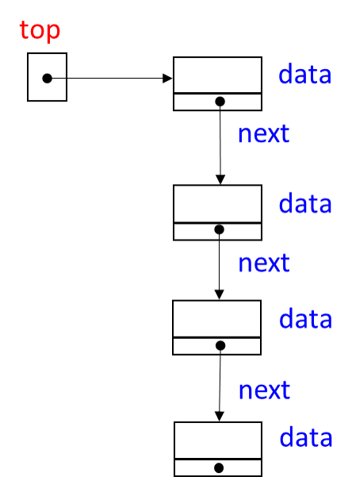
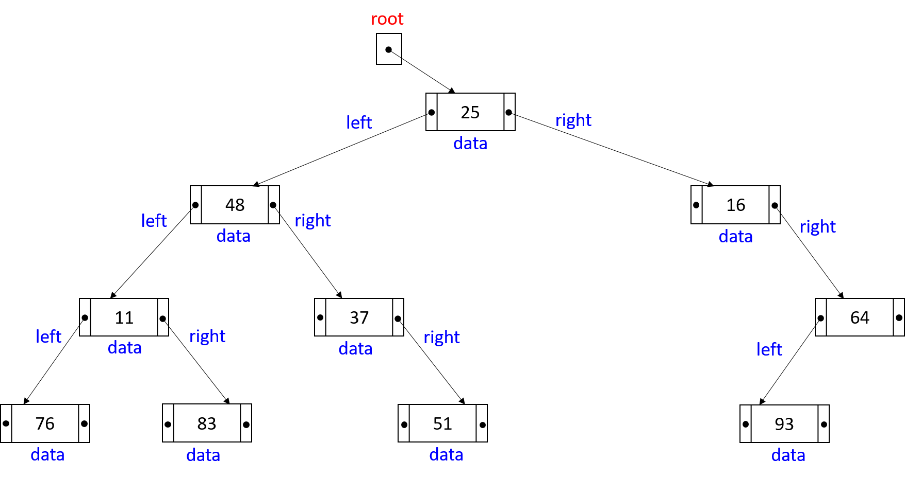

## 1. Linked List

### Limitations of arrays
  - size is static and bounded, dynamic resizing not possible
  - insert requires shifting out subsequent elements to right
  - delete requires shifting out subsequent elements to left

### What is a linked list?
  - A data structure that holds a pointer **head** to a chained link of nodes.
  - Each node contains 2 parts:
    1. **data**: holds the data
    2. **next**: holds link to the next node

### Visualizing linked list


### Properties of linked list
  - No random access.
  - To reach a node, always start from the head and traverse.

### Operations on linked list
  - insert
  - delete
  - search

### Problems based on linked list properties
  - Given a sequence of operations, print the state after each operation

### Implementing linked list
```
class Node {  
  int data;  
  Node next;  
}
```

```
class LinkedList {  
  Node head;  
  
  void insert(int pos, int key);
  void insert(int key);
  boolean delete(int pos);
  int search(int key); // returns position  
  int size();  
  void insertFirst(int key);
  void deleteFirst();
}
```

#### For a step-by-step implementation of LinkedList, please refer to [Linked List implementation step-by-step](LinkedList.md).

### LinkedList in Collections
  - [Javadoc page](https://docs.oracle.com/javase/7/docs/api/java/util/LinkedList.html)
  - [Examples from javatpoint](https://www.javatpoint.com/java-linkedlist)
  - [Examples from geeksfofgeeks](https://www.geeksforgeeks.org/linked-list-in-java/)
  - [Examples from callicoder](https://www.callicoder.com/java-linkedlist/)

### Problems from Leetcode
  1. [In a single traversal find the middle element/position](https://leetcode.com/problems/middle-of-the-linked-list/)
  2. [Design linked list](https://leetcode.com/problems/middle-of-the-linked-list/)
  3. [Merge two sorted lists into one](https://leetcode.com/problems/merge-two-sorted-lists/)
  4. [Rotate a linked list by k positions](https://leetcode.com/problems/rotate-list/)
  5. [Remove duplicates from a sorted list](https://leetcode.com/problems/remove-duplicates-from-sorted-list/)
  6. [Partition list based on > and <= x](https://leetcode.com/problems/partition-list/)
  7. [Remove linked list elements](https://leetcode.com/problems/remove-linked-list-elements/)
  8. [Intersection of two linked lists](https://leetcode.com/problems/intersection-of-two-linked-lists/)
  9. [Reverse a linked list](https://leetcode.com/problems/reverse-linked-list/)
  10. [Check if a linked list has a cycle](https://leetcode.com/problems/linked-list-cycle/)

### ArrayList in Collections
  - [Javadoc page](https://docs.oracle.com/javase/8/docs/api/java/util/ArrayList.html)
  - [Examples from javatpoint](https://www.javatpoint.com/java-arraylist)
  - [Examples from geeksforgeeks](https://www.geeksforgeeks.org/arraylist-in-java/)
  - [Examples from callicoder](https://www.callicoder.com/java-arraylist/)

### When to use LinkedList or ArrayList?
  - When inserts/deletes are more, use LinkedList
  - Otherwise ArrayList

---

## 2. Circular Linked List

### What is it?
  - Last node links back to first node

### Visualization


### Properties
   - Can reach the first node from the last node

### Operations
   - insert
   - delete
   - search
   - Rotate right **k** times
   - Rotate left = rotate right **size - k** times

### Implementation changes needed
  - insert and delete needs modification to set the **next** back to **head**
  - search needs modification to stop traversal as soon as **next** points to **head**

---

## 3. Doubly Linked List

### What is it?
  - Contains pointer to first node **head**
  - Each node contains 3 parts:
    1. **data**: holds the data
    2. **prev**: holds pointer to previous node
    3. **next**: holds pointer to next node

### Visualization


### Properties
  - Can traverse in both left and right directions

### Operations
  - insert
  - delete
  - search

### Implementation changes needed
  - insert and delete needs modification to set both **prev** and **next**
  
#### For the implementation of doubly linked list, visit [Doubly Linked List](DoublyLinkedList.md).
 
---

## 4. Stack

### What is it?
  - A data structure that holds pointer (**top**) to a chained link of nodes
  - A new node is pushed onto the stack, and it becomes the new top
  - Delete pops the top node from the stack, the below node becomes the top
  - It can be seen as restricted linked list that supports insert first (last) and delete first (last)

### Visualization


### Properties
  - **LIFO**: Last-In-First-Out
  - Insert and delete at one end only

### Operations
  - push
  - pop
  - peek

### Implementation
```
class Node {  
  int data;  
  Node next;  
}
```

```
class Stack {  
  Node top;  
  
  void push(int key);  
  int pop();   
  int peek();  
  int size();  
}
```

#### For the implementation of stack and its applications, please refer to [Stack and its applications](Stack.md).

### Stack in Collections
  - [Javadoc page](https://docs.oracle.com/javase/7/docs/api/java/util/Stack.html)
  - [Examples from javatpoint](https://www.javatpoint.com/data-structure-stack)
  - [Examples from geeksfofgeeks](https://www.geeksforgeeks.org/stack-class-in-java/)
  - [Examples from callicoder](https://www.callicoder.com/java-stack/)

### Problems from Leetcode
  1. [Reverse](https://leetcode.com/problems/validate-stack-sequences/)
  2. Check palindrome
  3. [Balanced parantheses](https://leetcode.com/problems/valid-parentheses/)
  4. [Postfix evaluation](https://leetcode.com/problems/evaluate-reverse-polish-notation/)
  5. [Basic calculator - Infix to postfix + postfix evaluation](https://leetcode.com/problems/basic-calculator/)
  6. [Min stack](https://leetcode.com/problems/min-stack/)
  7. [Remove k digits](https://leetcode.com/problems/validate-stack-sequences/)
  8. [Decode string](https://leetcode.com/problems/decode-string/)
  9. [Backspace string compare](https://leetcode.com/problems/backspace-string-compare/)
  10. [Score of parantheses](https://leetcode.com/problems/score-of-parentheses/)

---

## 5. Queue

### What is it?
  - A data structure that holds pointers (front, rear) to the first and last nodes of chained link of nodes
  - A new node is enqueued to the rear
  - Node is removed from the front
  - It can be seen as restricted linked list that supports insert last and delete first

### Visualization


### Properties
  - **FIFO**: First-In-First-Out
  - Insert at one end and remove from the other end

### Operations
  - enqueue
  - dequeue
  - peek

### Implementation
```
class Node {  
  int data;  
  Node next;  
 
  Node(int d);  
  int getData(); 
  Node getNext();
}
```

```
class Queue {  
  Node front;  
  Node rear;
  
  void enqueue(int key);  
  int dequeue();   
  int peek();  
  int size();  
}
```

#### For the implementation of queue in its different forms, please refer to [Queue implementation](Queue.md).

### ArrayDeque in Collections
  - [Javadoc page](https://docs.oracle.com/javase/7/docs/api/java/util/ArrayDeque.html)
  - [Examples from javatpoint](https://www.javatpoint.com/java-deque-arraydeque)
  - [Examples from geeksfofgeeks](https://www.geeksforgeeks.org/arraydeque-in-java/)
  - [Examples from baeldung](https://www.baeldung.com/java-array-deque)
  
### Problems from Leetcode
  1. [Task scheduler](https://leetcode.com/problems/task-scheduler/)
  2. [Stack using queue](https://leetcode.com/problems/implement-stack-using-queues/)
  3. [Queue using stack](https://leetcode.com/problems/implement-queue-using-stacks/)
  4. [Circular Queue](https://leetcode.com/problems/design-circular-queue/)
  5. [Circular Deque](https://leetcode.com/problems/design-circular-deque/)
  6. [Number of recent calls](https://leetcode.com/problems/number-of-recent-calls/)

---

## 6. Binary tree

### What is it?
  - A non-linear representation of nodes where each node links to 0, 1 or 2 child nodes
  - Child nodes are referred to as left and right
  - Topmost node is called root

### Visualization


### Properties
  - Access to any node always starts with the root

### Traversals
  - Level-order: Level-by-level from top to bottom, at each level left to right
    - **25 48 16 11 37 64 76 83 51 93**
  - Preorder: visit(node), preorder(left), preorder(right)
    - **25 48 11 76 83 37 51 16 64 93**
  - Inorder: inorder(left), visit(node), inorder(right)
    - **76 11 83 48 37 51 25 16 93 64**
  - Postorder: postorder(left), postorder(right), visit(node)
    - **76 83 11 51 37 48 93 64 16 25**

### Operations
  - insert
  - delete
  - search
  - preorder
  - inorder
  - postorder

### Implementation

```
class Node {  
  int data;  
  Node left;  
  Node right;  
  
  Node(int d);  
  boolean search(int key);  
  boolean insert(int key);  
  boolean delete(int key);  
  void preorder();  
  void inorder();  
  void postorder();  
}
```

```
class BinaryTree {  
  Node root;  
 
  boolean search(int key) { root.search(key); }   
  boolean insert(int key) { root.insert(key); }  // Implementation depends on the type of binary tree
  boolean delete(int key) { root.delete(key); }  // Implementation depends on the type of binary tree
  void preorder() { root.preorder(); }  
  void inorder() { root.inorder(); }  
  void postorder() { root.postorder(); }  
}
```

### Applications
  - Expression tree
  - Huffman encoding
  
## Problems from Leetcode
  1. [Inorder traversal](https://leetcode.com/problems/binary-tree-inorder-traversal/)
  2. [Preorder traversal](https://leetcode.com/problems/binary-tree-preorder-traversal)
  3. [Level order traversal](https://leetcode.com/problems/binary-tree-level-order-traversal)
  4. [Same tree](https://leetcode.com/problems/same-tree/)
  5. [Symmetric tree](https://leetcode.com/problems/symmetric-tree/)
  6. [Max depth](https://leetcode.com/problems/maximum-depth-of-binary-tree/)
  7. [Diameter](https://leetcode.com/problems/diameter-of-binary-tree)
  8. [Lowest common ancestor](https://leetcode.com/problems/lowest-common-ancestor-of-a-binary-tree)
  9. [Longest univalue path](https://leetcode.com/problems/longest-univalue-path)
  10. [Construct BT from preorder & inorder](https://leetcode.com/problems/construct-binary-tree-from-preorder-and-inorder-traversal)

---

## 7. Binary Heap

### Types
  - Min heap
  - Max heap

### What is min heap?
  - A binary tree in which each node's value is less than that of its left and right nodes


### What is max heap?
  - A binary tree in which each node's value is greater than that of its left and right nodes


### Properties
  - Access starts from the root
  - Min Heap property: **parent &lt; left, right**
    - Min element at the root
  - Max Heap property: **parent &gt; left, right**
    - Max element at the root
  - No constraints between left and right
  - Can be implemented as array for fast access

### Traversal
  - Level-order (array implementation suits this)
  - parent(i) = (i-1)/2
  - left(i) = 2i + 1
  - right(i) = 2i + 2
  


### Operations
  - insert
  - getMin (or getMax)

### Implementation

```
class MinHeap {
  int[] arr;
  int root;
  int size;
  
  MinHeap() { arr = int[100]; root = 0; size = 0; }
  int getParent(int i) { return (i-1)/2; }
  int getLeft(int i) { return 2*i + 1; }
  int getRight(int i) { return 2*i + 2; }
  void buildHeap();
  void insert(int key);
  void fixHeap();
  int getMin();
}
```

#### For a step-by-step implementation of MinHeap (a.k.a PriorityQueue), please refer to [Min Heap implementation step-by-step](MinHeap.md).

### Applications
  - Heap sort
  - Implement priority queue

### PriorityQueue in Collections
  - [Javadoc page](https://docs.oracle.com/javase/7/docs/api/java/util/PriorityQueue.html)
  - [Examples from javatpoint](https://www.javatpoint.com/java-priorityqueue)
  - [Examples from geeksfofgeeks](https://www.geeksforgeeks.org/priority-queue-class-in-java-2/)
  - [Examples from callicoder](https://www.callicoder.com/java-priority-queue/)

### Problems from Leetcode
  1. [Kth largest element in an array](https://leetcode.com/problems/kth-largest-element-in-an-array/)
  2. [Top K frequent elements](https://leetcode.com/problems/top-k-frequent-elements/)
  3. [Sort chars by frequency](https://leetcode.com/problems/sort-characters-by-frequency/)
  4. [Split array into consecutive subsequences](https://leetcode.com/problems/split-array-into-consecutive-subsequences/)
  5. [Top k frequent words](https://leetcode.com/problems/top-k-frequent-words)
  6. [Last stone weight](https://leetcode.com/problems/last-stone-weight)
  7. [K closest points to origin](https://leetcode.com/problems/k-closest-points-to-origin)
  8. [Distant bar codes](https://leetcode.com/problems/distant-barcodes)
  9. [Kth largest element in a stream](https://leetcode.com/problems/kth-largest-element-in-a-stream)
  10. [Network delay time](https://leetcode.com/problems/network-delay-time)

## 8. Binary Search Tree

### What is it?
  - A binary tree in which a node's value is greater than its left and smaller than its right

### Why is it needed?
 - To search faster
 - It takes O(n) time to search in a linked list
 - BST provides a way to reduce search time to O(logn)
   - Not always though!!!

### Visualization


### Properties
  - Access starts from the root
  - left &lt; data &lt; right
  - Inorder traversal results in sorted sequence

### Traversal
  - Usually inorder to retrieve sorted sequence
  - Other traversals are also common

### Operations
  - insert
  - delete
  - search
  - preorder, inorder, postorder

### Implementation

```
class Node {  
  int data;  
  Node left;  
  Node right;  
  
  Node(int d);  
  boolean search(int key);  
  boolean insert(int key);  
  boolean delete(int key);  
  void preorder();  
  void inorder();  
  void postorder();  
}
```

```
class BST {  
  Node root;  
 
  boolean search(int key) { root.search(key); }  
  boolean insert(int key) { root.insert(key); }  
  boolean delete(int key) { root.delete(key); }  
  void preorder() {root. preorder(); }  
  void inorder() { root.inorder(); }  
  void postorder() { root.postorder(); }  
}
```

#### For a step-by-step implementation of LinkedList, please refer to [Binary Search Tree implementation](BST.md).

### Additional Information

  - **search**: traverse recursively taking appropriate path at each level until node containing search element is found or leaf node is reached
  - **insert**: traverse recursively taking appropriate path at each level until point of insertion identified
  - **delete**: search, remove the node, replace it with the node containing next higher element
  - **preorder**: starting from root, traverse in node, preorder(left), preorder(right) manner
  - **inorder**: starting from root traverse in inorder(left), node, inorder(right) manner
  - **postorder**: starting from root traverse in postorder(left), postorder(right), node manner

### Problems from Leet code
  1. [Insert BST](https://leetcode.com/problems/insert-into-a-binary-search-tree)
  2. [Search BST](https://leetcode.com/problems/search-in-a-binary-search-tree)
  3. [Delete BST](https://leetcode.com/problems/delete-node-in-a-bst)
  4. [Validate BST](https://leetcode.com/problems/validate-binary-search-tree)
  5. [Trim BST](https://leetcode.com/problems/trim-a-binary-search-tree)
  6. [Lowest Common Ancestor](https://leetcode.com/problems/lowest-common-ancestor-of-a-binary-search-tree)
  7. [Sorted array to BST](https://leetcode.com/problems/convert-sorted-array-to-binary-search-tree)
  8. [Recover BST](https://leetcode.com/problems/recover-binary-search-tree)
  9. [Find Mode in a BST](https://leetcode.com/problems/find-mode-in-binary-search-tree)
  10. [Minimum distance between BST nodes](https://leetcode.com/problems/minimum-distance-between-bst-nodes)

## 9. AVL Tree

### What is it?
  - A binary search tree which is height-balanced

### Visualization

### Properties
  - Height balanced: The height of the left and right subtrees differ by at most 1

### Traversal
  - Usually inorder 
    - for retrieving sorted sequence
  - Other traversals are also common

### Operations
  - insert, delete, search
  - preorder, inorder, postorder
  - rotateWithLeft
  - rotateWithRight
  - computeBalance
  - height

### Implementation
```
class Node {  
  int data;  
  Node left;  
  Node right; 
  int balanceFactor;
  
  Node(int d);  
  boolean search(int key);  
  boolean insert(int key);  
  boolean delete(int key);  
  void preorder();  
  void inorder();  
  void postorder();  
  void rotateWithLeft();
  void rotateWithRight();
}
```

```
class AVLTree {  
  Node root;  

  boolean search(int key) { root.search(key); }  
  boolean insert(int key) { root.insert(key); }  
  boolean delete(int key) { root.delete(key); }  
  void preorder() { root.preorder(); }  
  void inorder() { root.inorder(); }  
  void postorder() { root.postorder(); }  
}
```

The AVL Tree implementation is given [here](AVLTree.md)

### Problems
  1. Median of two sorted arrays
  
## 10. Graph

### What is it?
A non-linear data structure that contains a group of node/vertices where each node/vertex maintains a list of adjacent nodes.

### Visualization


### Representation
  1. Adjacency List
  ```
  0: 1 -> 2
  1: 4
  2: 1 -> 4
  3: 0 -> 2 -> 4
  4: 
  ```
  2. Adjacency Matrix
  ```
  ------------
  .| 0 1 2 3 4 
  ------------
  0| x 1 1 0 0
  1| 0 x 0 0 1
  2| 0 1 x 0 1
  3| 1 0 1 x 1
  4| 0 0 0 0 x
  ------------
  ```
  3. Edge List
  ```
  (0,1) (0,2) (1,4) (2,1) (2,4) (3,0) (3,2) (3,4)
  ```
  
  4. Incidence List
  ```
  0: 3
  1: 0 -> 2
  2: 0 -> 3
  3:
  4: 1 -> 2 -> 3
  ```
  5. Incidence Matrix
  ```
  ------------
  .| 0 1 2 3 4 
  ------------
  0| x 0 0 1 0
  1| 1 x 1 0 0
  2| 1 0 x 1 0
  3| 0 0 0 x 0
  4| 0 1 1 1 x
  ------------
  ```
  
### Traversals
  - Depth First Search (DFS)
  

  - Breadth First Search (BFS)
  
  
### Implementation
  - addEdge
  - dfs
  - bfs
  - connectivity
  - path, cycle
  - components
  
For a step-by-step implementation of a graph, please refer [Graph Implementation](Graph.md).

### Problems from Leetcode & Hackerrank
  1. [Find eventual safe states](https://leetcode.com/problems/find-eventual-safe-states/)
  2. [Clone graph](https://leetcode.com/problems/clone-graph/)
  3. [Course schedule](https://leetcode.com/problems/course-schedule/)
  4. [Reconstruct itinerary](https://leetcode.com/problems/reconstruct-itinerary/)
  5. [Is graph bipartite](https://leetcode.com/problems/is-graph-bipartite/)
  6. [Cheapest flight within K stops](https://leetcode.com/problems/cheapest-flights-within-k-stops/)
  7. [Snake and ladder](https://leetcode.com/problems/snakes-and-ladders/)
  8. [Connected component & cycle](https://www.hackerrank.com/contests/data-structure-tasks-binary-tree-union-find/challenges/connected-component)
  9. [DFS Edges](https://www.hackerrank.com/challenges/dfs-edges/problem)
  10. [Rotting oranges](https://leetcode.com/problems/rotting-oranges)

## 11. Disjoint-Set

### What is it?

A disjoint set is an unordered collection items without duplicates.

### Visualizing Disjoint-Set

### Properties of Disjoint-Set
 - Items are unordered
 - No duplicates

### Operations
 - Union
 - Find

### Implementation

```
class Node {
    int label;
    Node parent;

    Node(int l);
}
```

```
class Set {
    Node[] arr;

    void makeSet(int size);
    int find(int key);
    void union(int key1, int key2);
}
```

For a step-by-step implementation of Disjoint-Set, please refer to [Disjoint-Set implementation](DisjointSet.md)

### Problems from Leetcode


## 12. Hashing/Map/Dictionary/Associative Array

