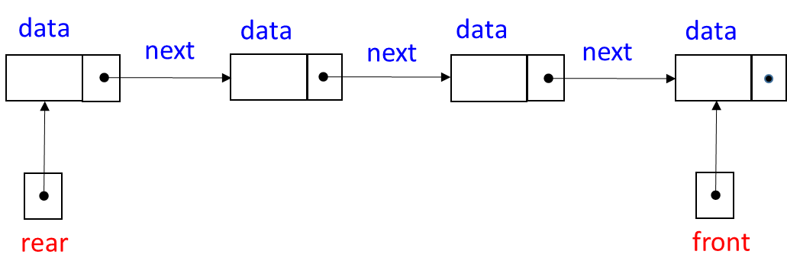
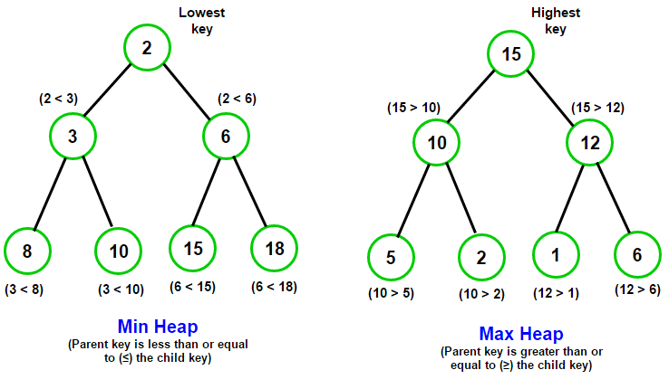
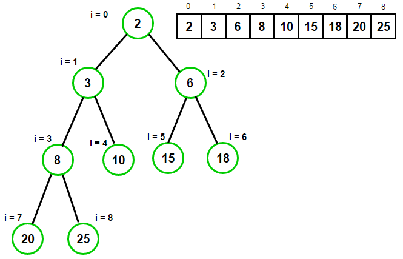

## 1. Linked List

### Limitations of arrays
  - size is static and bounded, dynamic resizing not possible
  - insert requires shifting out subsequent elements to right
  - delete requires shifting out subsequent elements to left

### What is a linked list?
  - A data structure that holds a pointer **head** to a chained link of nodes.
  - Each node contains 2 parts:
    1. **data**: holds the data
    2. **next**: holds link to the next node

### Visualizing linked list


### Properties of linked list
  - No random access.
  - To reach a node, always start from the head and traverse.

### Operations on linked list
  - insert
  - delete
  - search

### Problems based on linked list properties
  - Given a sequence of operations, print the state after each operation

### Implementing linked list
```
class Node {  
  int data;  
  Node next;  
 
  Node(int d);  
  getData(); 
  getNext();
}
```

```
class LinkedList {  
  Node head;  
  
  createHead(); // creates first node  
  insertFirst(int key); // returns new head  
  insert(int pos, int key);  
  insert(int key);  
  deleteHead(); // delete last remaining node  
  delete(int pos);  
  search(int key); // returns position  
  size();  
}
```

### LinkedList in Collections
  - Examples

### Problems on linked list (use Collections' LinkedList)
  1. In a single traversal find the middle element/position
  2. Create a sorted list as you read elements (sort a linked list)
  3. Merge two sorted lists into one
  4. Rotate a linked list by k positions
  5. Remove duplicates from a sorted list (shrink the list)
  6. Partition list based on > and <= x (based on pivot, odd/even)
  7. Union of two linked lists keep duplicates (remove duplicates)
  8. Intersection of two linked lists
  9. Reverse a linked list
  10. Check if a linked list has a cycle

### ArrayList in Collections
  - When to use LinkedList or ArrayList?

---

## 2. Circular Linked List

### What is it?
  - Last node links back to first node

### Visualization


### Properties
   - Can reach the first node from the last node

### Operations
   - insert
   - delete
   - search
   - Rotate right **k** times
   - Rotate left = rotate right **size - k** times

### Implementation changes needed
  - insert and delete needs modification to set the **next** back to head
  - search needs modification to stop traversal as soon as **next** points to head

---

## 3. Doubly Linked List

### What is it?
  - Contains pointer to first node **head**
  - Each node contains 3 parts:
   1. **data**: holds the data
   2. **prev**: holds pointer to previous node
   3. **next**: holds pointer to next node

### Visualization


### Properties
  - Can traverse in both left and right directions

### Operations
  - insert
  - delete
  - search

### Implementation changes needed
  - insert and delete needs modification to set both **prev** and **next**
 
---

## 4. Stack

### What is it?
  - A data structure that holds pointer (top) to a chained link of nodes
  - A new node is pushed onto the stack, and it becomes the new top
  - Delete pops the top node from the stack, the below node becomes the top
  - It can be seen as restricted linked list that supports insert last and delete last

### Visualization


### Properties
  - LIFO: Last-In-First-Out
  - insert and delete at one end only

### Operations
  - push
  - pop
  - peek

### Implementation
```
class Node {  
  int data;  
  Node next;  
 
  Node(int d);  
  getData(); 
  getNext();
}
```

```
class Stack {  
  Node top;  
  
  push(int key);  
  int pop();   
  int peek();  
  size();  
}
```

### Stack in Collections
  - Examples

### Problems
  1. Reverse
  2. Check palindrome
  3. Balanced parantheses
  4. infix to prefix
  5. infix to postfix
  6. Min stack
  7. Basic calculator*
  8. Decode string
  9. Backspace string compare
  10. Score of parantheses

---

## 5. Queue

### What is it?
  - A data structure that holds pointers (front, rear) to the first and last nodes of chained link of nodes
  - A new node is enqueued to the rear
  - Node is removed from the front
  - It can be seen as restricted linked list that supports insert last and delete first

### Visualization


### Properties
  - FIFO: First-In-First-Out
  - insert at one end and remove from the other end

### Operations
  - enqueue
  - dequeue
  - peek

### Implementation
  - enqueue: insert node at the end
  - dequeue: remove node from the beginning
  - peek: check the front node without removing it

### ArrayDeque in Collections
  - Examples

### Problems
  - Task scheduler
  - Stack using queue
  - Queue using stack

---

## 6. Binary tree

### What is it?
  - A non-linear representation of nodes where each node links to 0, 1 or 2 child nodes
  - Child nodes are referred to as left and right
  - Topmost node is called root

### Visualization


### Properties
  - Access to any node always starts with the root

### Traversals
  - Level-order: Level-by-level from top to bottom, at each level left to right
   - **1 2 3 4 5 6 7 8 9 10 11 13 14**
  - Preorder: visit(node), preorder(left), preorder(right)
   - **1 2 4 8 9 5 10 11 3 6 13 7 14**
  - Inorder: inorder(left), visit(node), inorder(right)
   - **8 4 9 2 10 5 11 1 6 13 3 14 7**
  - Postorder: postorder(left), postorder(right), visit(node)
   - **8 9 4 10 11 5 2 13 6 14 7 3 1**

### Operations
  - insert
  - delete
  - search

### Implementation
  - insert: depends on the type of binary tree
  - delete: depends on the type of binary tree
  - search: one of the traversal methods, depends on type of binary tree

### Applications
  - Expression tree
  - Huffman encoding

---

## 7. Binary Heap

### Types
  - Min heap
  - Max heap

### What is min heap?
  - A binary tree in which each node's value is less than that of its left and right nodes

### What is max heap?
  - A binary tree in which each node's value is greater than that of its left and right nodes

### Visualization


### Properties
  - Access starts from the root
  - Min Heap property: parent &lt; left, right
   - Min element at the root
  - Max Heap property: parent &gt; left, right
   - Max element at the root
  - No constraints between left and right
  - Can be implemented as array for fast access

### Traversal
  - Level-order (due to array implementation)
  


### Operations
  - insert
  - getMin (or getMax)

### Implementation
  - Defining min heap using array
  - getLeft
  - getRight 
  - getParent
  - buildHeap
  - insert
  - fixHeap
  - getMin

### Applications
  - Heap sort
  - Implement priority queue

### PriorityQueue in Collections
  - Examples

### Problems
  1. Kth largest element in an array
  2. Top K frequent elements
  3. Split array into consecutive subsequences
  4. Last stone weight
  5. K closest points to origin

## 8. Binary Search Tree

### What is it?
  - A binary tree in which a node's value is greater than its left and smaller than its right

### Why is it needed?
 - To search faster
 - It takes O(n) time to search in a linked list
 - BST provides a way to reduce search time to O(logn)
  - Not always though

### Visualization


### Properties
  - Access starts from the root
  - left &lt; data &lt; right
  - Inorder traversal results in sorted sequence

### Traversal
  - Usually inorder to retrieve sorted sequence
  - Other traversals are also common

### Operations
  - insert
  - delete
  - search
  - preorder
  - inorder
  - postorder

### Implementation

```
class Node {  
  - int data;  
  - Node left;  
  - Node right;  
.  
  - Node(int d);  
  - search(int d);  
  - insert(int d);  
  - delete(int d);  
  - preorder(Node n);  
  - inorder(Node n);  
  - postorder(Node n);  
}
```

```
class BST {  
  - Node root;  
.  
  - search(int d) { root.search(); }  
  - insert(int d) { root.insert(); }  
  - delete(int d) { root.delete(); }  
  - preorder() { preorder(root); }  
  - inorder() { inorder(root); }  
  - postorder() { postorder(root); }  
}
```

  - search: traverse recursively taking appropriate path at each level until search element is found or leaf node is reached
  - insert: traverse recursively taking appropriate path at each level until point of insertion identified
  - delete: search, remove the node, replace it with the node containing next higher element
  - preorder: starting from root, traverse in node, preorder(left), preorder(right) manner
  - inorder: starting from root traverse in inorder(left), node, inorder(right) manner
  - postorder: starting from root traverse in postorder(left), postorder(right), node manner

### Problems
  1. Compute height of the tree
  2. Compute height of the root's left subtree and root's right subtree
  3. Compute height of every node of the tree
  4. Compute weight of the tree
  5. Compute weight of the root's left and root's right
  6. Compute weight of every node of the tree
  7. Compute the diameter of the tree
  8. Compute the lowest common ancestor of two nodes
  9. Count the number of internal and leaf nodes of the tree
  10. Check if the tree is complete, perfect

## 9. AVL Tree

### What is it?
  - A binary search tree which is height-balanced

### Visualization

### Properties
  - Height balanced: The height of the left and right subtrees differ by at most 1

### Traversal
  - Usually inorder ### for retrieving sorted sequence
  - Other traversals are also common

### Operations
  - insert
  - delete
  - search

### Implementation
  - Include balance to Node class
  - LL rotation
  - LR rotation
  - RL rotation
  - RR rotation
  - insert
  - delete
  - search

### Problems
